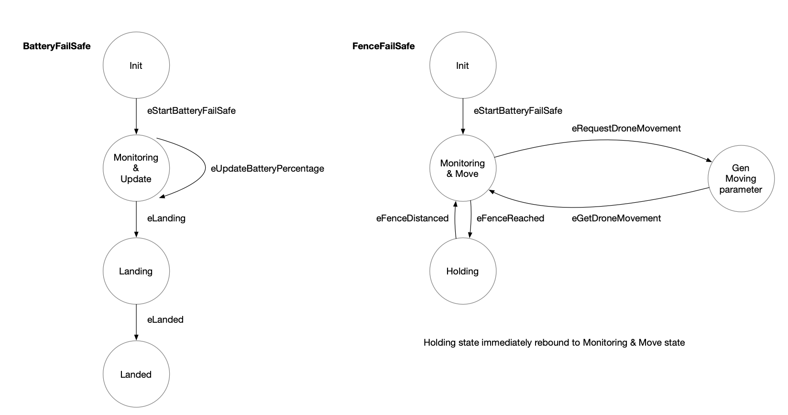
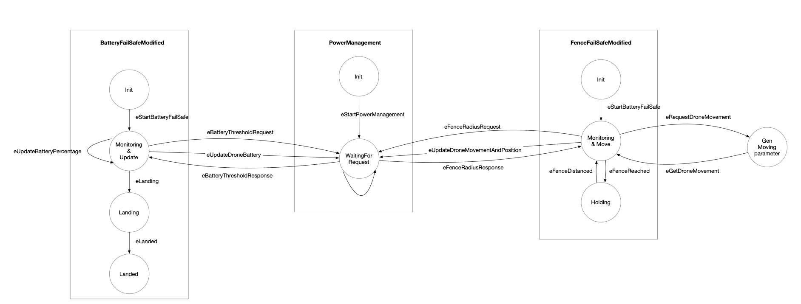

# **Power Constraint Challenge**
# Introduction
This repository is setup for the VSPELLS engagement 3, MAVLink Power Constraint problem. The goal is to modify the **_BatteryFailSafe_** and **_GeoFence_** mode to ensure that the drone lands at the origin (HOME setpoint, Launch point) upon running out of battery, and ensure that it does not go to places that it is unable to return due to the battery constraints.

# File Descriptions
## Naive Model
We first modeled the existing functionality of the battery model safe and the Geofencing feature into the following state model. The following P models reflects the state machine modeled below:
- `BatteryFailSafe.p`: decrement the battery 1% at each update cycle, and land the drone when the drone battery dips below a certain pre-set threshold.
- `GeoFence.p`: randomly move the drone horizontally and vertically, initiating a holding pattern for the drone when approaching the fence to prevent the drone from flying out.



## Updated Model
The model addresses the engagement challenge by making slight modifications to the existing models. The structure of the new model is similar to the [Client-Server example](https://p-org.github.io/P/tutorial/clientserver/) in the P tutorial, where **PowerManagement** state machine is the "server" where the two other features are the clients:
- `PowerManagement.p`: PowerManagement state machine serves as a hub for storing all the relevant parameter
And transfer it between the two different state machines, namely BatteryFailSafeModified and GeoFenceModified. There's one critical state *WaitingForRequest* which has multiple functionalities
  1. Supply dynamic battery threshold
  2. Supply the dynamic fence radius 
  3. Cache battery percentage (for calculating the fence)
  4. Cache drone position relative to origin and cumulative drone movement in meters since the last update (for calculating the battery threshold and model battery depletion)
- `BatteryFailSafeModified.p`: BatteryFailSafeModified machine uses the **cumulativeDroneMovement** parameter in the PowerManagement machine to model the battery depletion
It ensures that the drone goes back to the HOME setpoint (return to launch) when the battery is below a certain threshold
- `GeoFenceModified.p`: GeoFenceModified machine response from the power management state machine to set the geoFence, and prevent the drone from flying out of the fence boundary.


# Usage
```bash
# compile the PSrc, PSpec and PTst
p compile 

# model check the P model against the PSpec.
# the specific spec/property must be declared via assert in PTst
p check  

# model check specific test cases
p check -tc <test-case>
```
# FAQ
## Overwhemling amount of errors
- try deleting the `PGenerated/` directory and retry again.


## Error: Failed to get test method ""
- Detailed Error: `Error: Failed to get test method '' from assembly 'Hello, Version=1.0.0.0, Culture=neutral, PublicKeyToken=null'`
    - reinstall or update the P programming language
